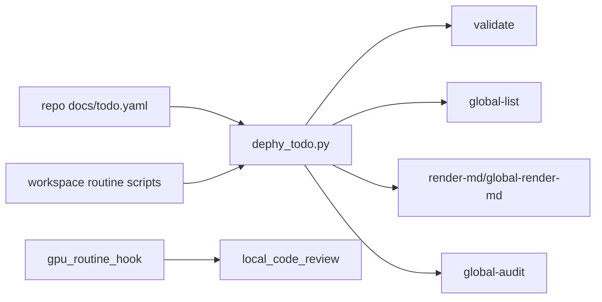
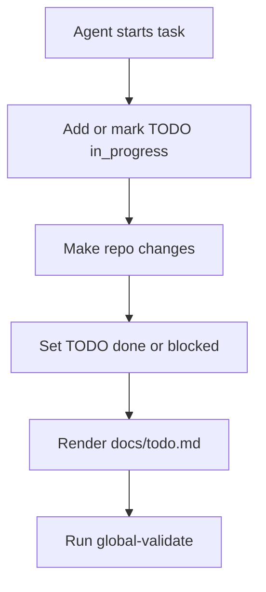

# dephy_todo

Global TODO and routine automation module for the Dephy workspace.

## Overview

`dephy_todo` is the global TODO entry point. Each repo owns `docs/todo.yaml`;
this module validates, lists, renders, audits, and summarizes TODO state across
the workspace.

## Key Value

- Structured YAML TODO state instead of chat-only memory.
- Local and global validation/list/render commands.
- JSON output for automation and Markdown output for humans.
- Workspace routine scan, local acceleration scan, CPU-parallel test runner, and
  optional GPU/local-model code review hook.
- Global audit skips dependency/build output directories.

## How To Use

```sh
tools/dephy_todo.py validate docs/todo.yaml
tools/dephy_todo.py render-md docs/todo.yaml docs/todo.md
tools/dephy_todo.py global-validate /home/judd/moxa/personal
tools/dephy_todo.py global-list /home/judd/moxa/personal --open-only
tools/dephy_todo.py global-list /home/judd/moxa/personal --format json
tools/workspace_routine.sh /home/judd/moxa/personal
tools/parallel_test_runner.sh /home/judd/moxa/personal
tools/workspace_cppcheck.sh /home/judd/moxa/personal
tools/local_code_review.sh --dry-run /home/judd/moxa/personal/mqtt_min_broker
tools/benchmark_local_review.sh /home/judd/moxa/personal/mqtt_min_broker
DEPHY_LOCAL_REVIEW_BENCH_MODEL=1 \
  tools/benchmark_local_review.sh /home/judd/moxa/personal/mqtt_min_broker
DEPHY_LOCAL_REVIEW=1 DEPHY_LOCAL_REVIEW_MODEL=deepseek-coder:latest \
  tools/gpu_routine_hook.sh /home/judd/moxa/personal/mqtt_min_broker
DEPHY_LOCAL_REVIEW_PROVIDER=openai \
DEPHY_LOCAL_REVIEW_BASE_URL=http://127.0.0.1:8000/v1 \
DEPHY_LOCAL_REVIEW_MODEL=Qwen2.5-Coder-7B-Instruct \
  tools/local_code_review.sh /home/judd/moxa/personal/mqtt_min_broker
GITHUB_TOKEN=... tools/sync_github_metadata.sh /home/judd/moxa/personal
```

## Architecture Flow



## Example User Scenario



## Simple Principle

TODO YAML is the source of truth. Markdown, routine summaries, and global lists
are generated views.

`local_code_review.sh` is only a preliminary reviewer. It can call Ollama or a
vLLM/OpenAI-compatible local endpoint to produce first-pass findings from git
diff context; Codex should still make the final review judgment.

## Performance

On this host, 10 repo quick tests measured about 2.40s with `JOBS=1` and 0.82s
with `JOBS=12`.

Local review context preparation is benchmarked with
`tools/benchmark_local_review.sh`. Set `DEPHY_LOCAL_REVIEW_BENCH_MODEL=1` to
include actual Ollama/vLLM generation time. On this host, context preparation
measured about 31-37 ms with an explicit model and about 70-71 ms with Ollama
auto model detection, while `llama3.2:latest` produced a quality-gated Ollama
review in about 5.435-11.422 s depending on warmup.

## Systematic Regression Testing

From the workspace root, run the shared pytest regression module:

```sh
../dephy_testkit/.venv/bin/python -m pytest ../dephy_testkit/tests/regression --module dephy_todo
../dephy_testkit/.venv/bin/python -m pytest ../dephy_testkit/tests/regression --module dephy_todo --profile integration
```

The local repo test remains:

```sh
make test
```

## Docs

- `docs/schema.md`: TODO YAML schema.
- `docs/module_structure.md`: CLI and discovery structure.
- `docs/local_review_benchmark.md`: local-model review timing and quality notes.
- `docs/todo.md`: current TODO summary.

## License

MIT. See `LICENSE` and `NOTICE.md`. Reuse and references are allowed, but the
copyright notice and attribution to Judd (judadao) must be preserved.
