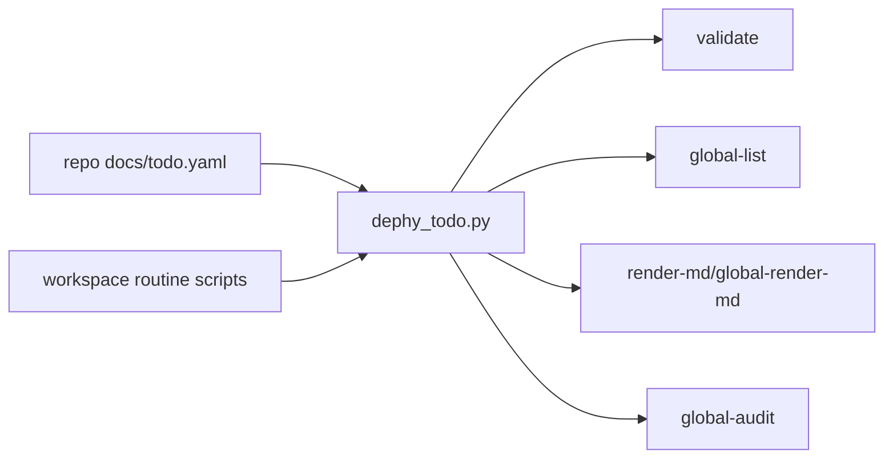
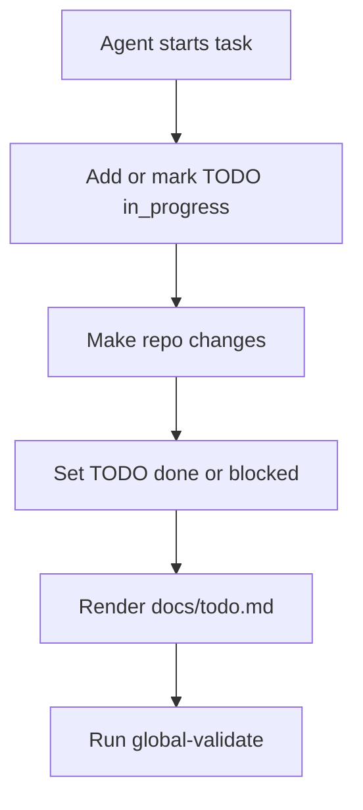

# dephy_todo

Global TODO and routine automation module for the Dephy workspace.

## Overview

`dephy_todo` is the global TODO entry point. Each repo owns `docs/todo.yaml`;
this module validates, lists, renders, audits, and summarizes TODO state across
the workspace.

## Key Value

- Structured YAML TODO state instead of chat-only memory.
- Local and global validation/list/render commands.
- JSON output for automation and Markdown output for humans.
- Workspace routine scan, local acceleration scan, CPU-parallel test runner, and
  optional GPU routine hook.
- Global audit skips dependency/build output directories.

## How To Use

```sh
tools/dephy_todo.py validate docs/todo.yaml
tools/dephy_todo.py render-md docs/todo.yaml docs/todo.md
tools/dephy_todo.py global-validate /home/judd/moxa/personal
tools/dephy_todo.py global-list /home/judd/moxa/personal --open-only
tools/dephy_todo.py global-list /home/judd/moxa/personal --format json
tools/workspace_routine.sh /home/judd/moxa/personal
tools/parallel_test_runner.sh /home/judd/moxa/personal
```

## Architecture Flow



## Example User Scenario



## Simple Principle

TODO YAML is the source of truth. Markdown, routine summaries, and global lists
are generated views.

## Performance

On this host, 10 repo quick tests measured about 2.40s with `JOBS=1` and 0.82s
with `JOBS=12`.

## Docs

- `docs/schema.md`: TODO YAML schema.
- `docs/module_structure.md`: CLI and discovery structure.
- `docs/todo.md`: current TODO summary.
